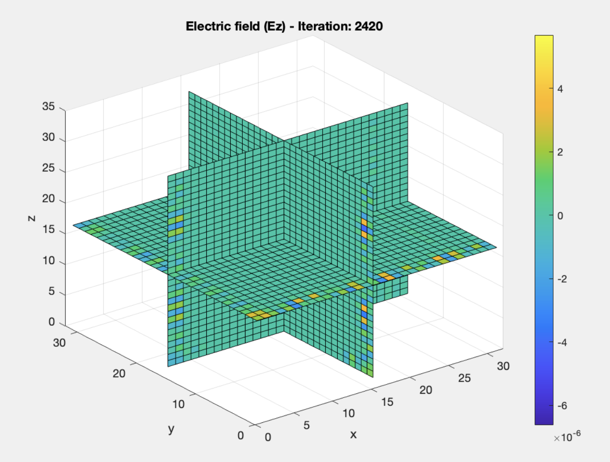
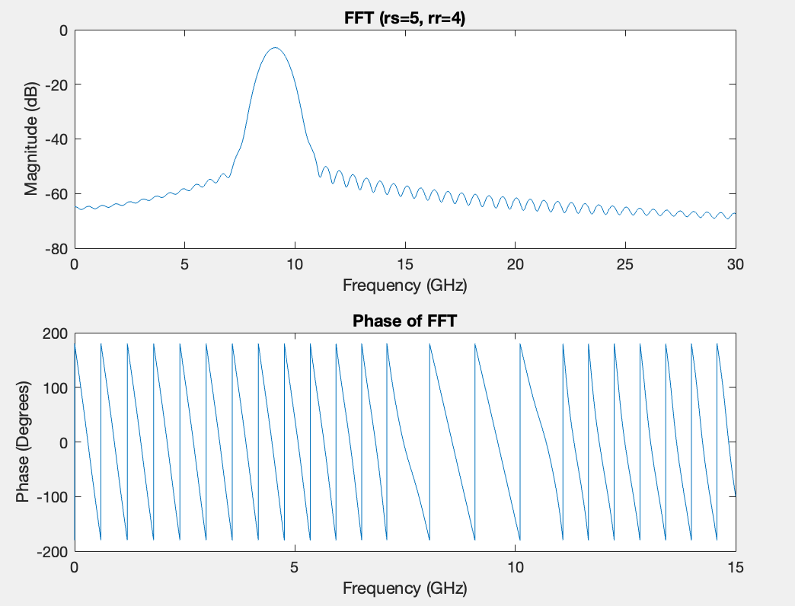
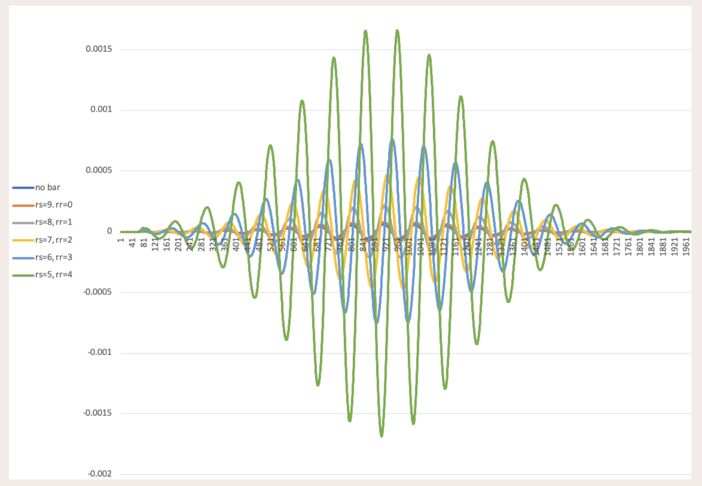
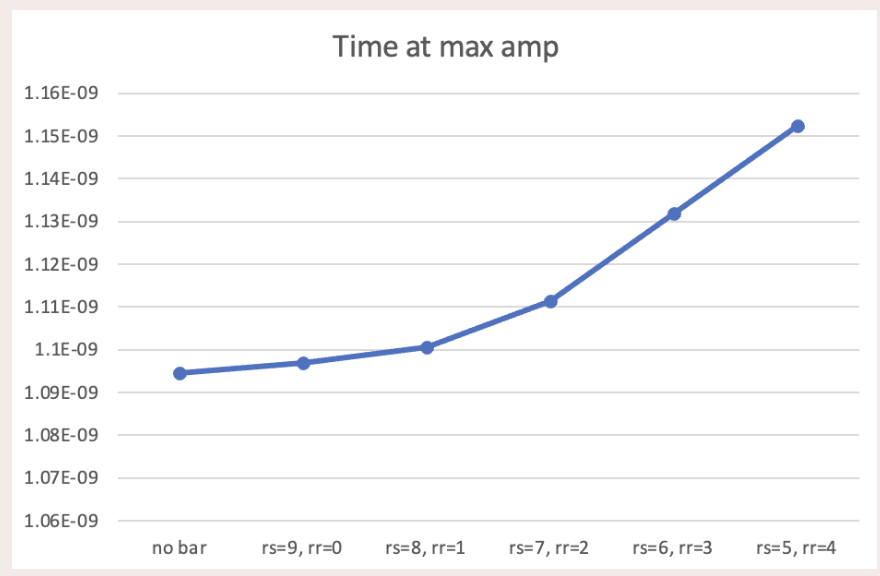

# FDTD Analysis of EM Waves in Corroded Reinforced Concrete

## Overview

This project implements a Finite-Difference Time-Domain (FDTD) simulation to analyze electromagnetic wave propagation in corroded reinforced concrete structures. The simulation aims to provide a non-destructive testing method for assessing the integrity and durability of concrete-rebar infrastructures.

## Methodology

### FDTD Algorithm

The simulation uses the Yee algorithm for spatial and temporal interleaving of electric and magnetic fields. The algorithm provides second-order accuracy in finite difference method (FDM) calculations.

Key equations for lossy media:

- Electric field update:
  $E_{x,y,z}^{n+1} = \frac{2\varepsilon - \sigma\Delta t}{2\varepsilon + \sigma\Delta t}E_{x,y,z}^{n} - \frac{2\Delta t}{2\varepsilon + \sigma\Delta t}(\nabla \times H)_{x,y,z}^{n+1/2}$

- Magnetic field update:
  $H_{x,y,z}^{n+1/2} = H_{x,y,z}^{n-1/2} - \frac{\Delta t}{\mu}(\nabla \times E)_{x,y,z}^n$

### Absorbing Boundary Conditions

Mur's 1st and 2nd order ABCs are experimented to simulate infinite space propagation across ends where the pulse excitation and takes place. The code implemets the following equations to simulate these conditions:

1st order: $E_z(i, j, k) \vert_{n+1} = E_z(i+1, j, k) \vert_n + \frac{c\Delta t - \Delta x}{c\Delta t + \Delta x} \left( E_z(i+1, j, k) \vert_{n+1} - E_z(i, j, k) \vert_n \right)$

2nd order: $E_z(i, j, k) \vert_{n+1} = \frac{c\Delta t - \Delta x}{c\Delta t + \Delta x} \left( E_z(i+1, j, k) \vert_{n+1} - E_z(i, j, k) \vert_n \right) + \frac{2}{(c\Delta t + \Delta x)} \left( E_z(i+2, j, k) \vert_n - 2E_z(i+1, j, k) \vert_n + E_z(i, j, k) \vert_n \right)$

### Corrosion Modeling

Corrosion is modeled using a multi-layer dielectric approach:
- Conductive steel layer (rebar)
- Rust coating with specific relative permittivity
- Surrounding concrete

The degree of corrosion is estimated by the percentage loss in rebar weight, with rust occupying up to four times the volume lost by the rebar.

## Key Features

1. 3D FDTD simulation of EM wave propagation
2. Modulated Gaussian pulse excitation
3. Mur's 2nd order Absorbing Boundary Conditions
4. Circular and cuboidal rebar modeling
5. Variable corrosion levels (0% to 30%)
6. FFT analysis for frequency-domain characterization

## Results

### Time-Domain Analysis

- Demonstrated wave propagation through concrete with varying levels of rebar corrosion
- Observed increased delay in wave propagation with increasing corrosion levels

### Frequency-Domain Analysis

- FFT analysis revealed changes in magnitude and phase spectra for different corrosion levels
- Observed shifts in center frequency and variations in 3dB bandwidth with increasing corrosion

### Corrosion-Delay Relationship

- Established an approximately linear relationship between rust thickness and output wave delay
- 3D simulations showed more significant delays compared to 2D simulations, better representing real-world interactions

  
  

## References

1. Roqueta, Gemma & Jofre, Lluis & Feng, Maria. (2012). Analysis of the Electromagnetic Signature of Reinforced Concrete Structures for Nondestructive Evaluation of Corrosion Damage. IEEE Transactions on Instrumentation and Measurement - IEEE TRANS INSTRUM MEAS. 61. 1090-1098. 10.1109/TIM.2011.2174106.
2. G. Mur, "Total-field absorbing boundary conditions for the time-domain electromagnetic field equations," in IEEE Transactions on Electromagnetic Compatibility, vol. 40, no. 2, pp. 100-102, May 1998, doi: 10.1109/15.673614.
